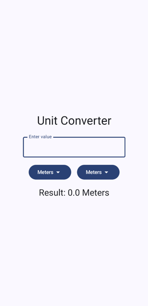
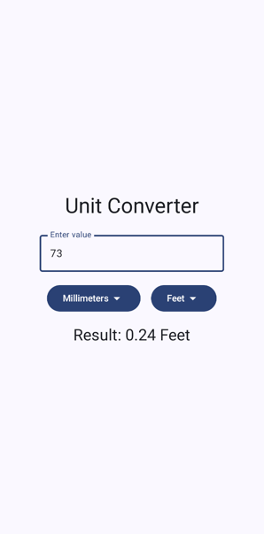

# UnitConverter

### Simple android application for converting some types of units of distance measurement such as meters, centimeters, millimeters and feet

## Used technologies and tools

- Kotlin
- Android SDK
- Jetpack Compose
- Mutable States

*This project was developed as part of The Complete Android 14 & Kotlin Development Masterclass by TutorialsEU*

*Minimum supported Android version is Android 7 (Nougat)*

## Illustrations

### Start screen

### Converting units

